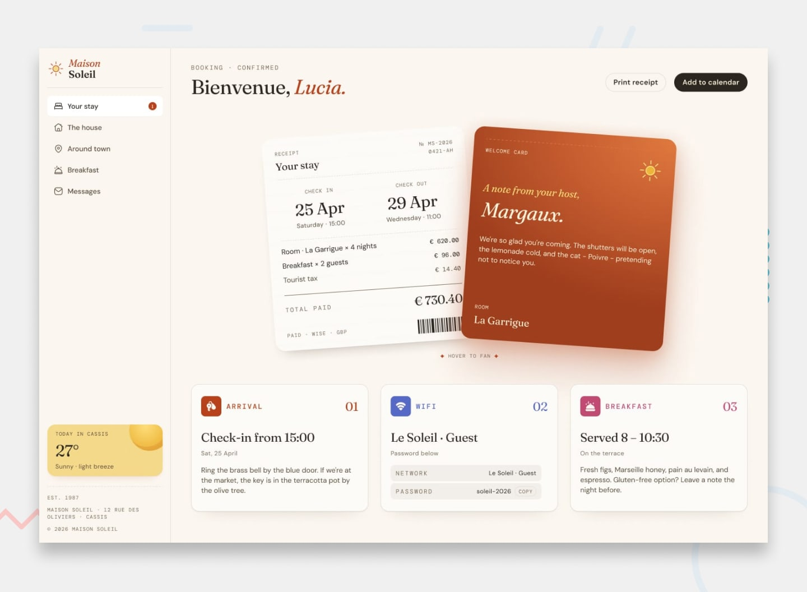

# Maison Soleil: Guest House

A guest portal for **Maison Soleil**, a small guest house in Cassis, France. It began as the [Frontend Mentor hotel booking confirmation page challenge](https://www.frontendmentor.io/challenges/hotel-booking-confirmation-page) and grew into a multi-page React app. Guests can check their booking, look around the house, browse breakfast, explore the town and message their host.



## Features

### Your Stay (`/`)
- A booking confirmation with a printed-style receipt card and a welcome note from the host
- A **Print receipt** button that opens the browser's print dialog, with a print-friendly layout
- An **Add to calendar** button that downloads a `.ics` file for the stay dates
- Info cards for arrival, Wi-Fi and breakfast, with a one-click Wi-Fi password copy and a toast confirmation
- Live weather for Cassis from the [Open-Meteo API](https://open-meteo.com/)

### The House (`/the-house`)
- A spaces gallery on desktop: click a thumbnail to make it the featured image
- A swipeable carousel of the spaces on mobile (Embla Carousel)
- An amenities grid and the house rules

### Breakfast (`/breakfast`, `/breakfast/:id`)
- Breakfast dishes fetched from [TheMealDB](https://www.themealdb.com/api.php)
- A detail page for each dish with its ingredients and step-by-step instructions

### Around Town (`/around-town`)
- An illustrated map of Cassis with numbered pins
- Filters for Eat & drink, Swim, and Walk & explore, synced with the list of places

### Messages (`/messages`)
- A chat with the host, with a typing indicator and canned replies based on keywords
- Quick-reply suggestions for common questions
- Chat history saved to `localStorage`, with a button to clear the conversation

### General
- A responsive layout: a sidebar on desktop and a toggleable menu on smaller screens
- Hover and focus states on interactive elements
- SPA rewrites in `vercel.json`, so reloading any route doesn't return a 404

## Built with

- [React 19](https://react.dev/) + [TypeScript](https://www.typescriptlang.org/)
- [Vite](https://vite.dev/)
- [Tailwind CSS v4](https://tailwindcss.com/)
- [React Router](https://reactrouter.com/)
- [Embla Carousel](https://www.embla-carousel.com/)
- [React Icons](https://react-icons.github.io/react-icons/)
- Fonts: Fraunces, DM Sans and DM Mono (Google Fonts)

## Getting started

You need [Node.js](https://nodejs.org/) 20 or later.

```bash
git clone https://github.com/fabusuyi-deborah/Maison-Guest-house.git
cd Maison-Guest-house
npm install
npm run dev
```

The app then runs at `http://localhost:5173`.

### Scripts

| Command           | What it does                              |
| ----------------- | ----------------------------------------- |
| `npm run dev`     | Starts the dev server with hot reload     |
| `npm run build`   | Type-checks and builds for production     |
| `npm run preview` | Serves the production build locally       |
| `npm run lint`    | Runs ESLint                               |

## Project structure

```
src/
├── App.tsx              # Route definitions
├── MainLayout.tsx       # Sidebar + mobile header shell
├── components/          # Receipt, info cards, weather, sidebar, etc.
│   ├── breakfast/
│   └── house/           # Gallery, carousel, amenities, house rules
├── pages/               # One component per route
├── types/index.ts       # Shared types and static content data
└── assets/images/
hotel-booking-confirmation-page-main/   # Original challenge files (designs, style guide, fonts)
```

## Deployment

The site is deployed on [Vercel](https://vercel.com/). `vercel.json` rewrites every path to `index.html`, so client-side routes work when the page is reloaded.

Live link : [Project live link](https://maison-guest-house-l15c.vercel.app/)

## Author

- GitHub: [@fabusuyi-deborah](https://github.com/fabusuyi-deborah)

## Acknowledgments

- The design and starter assets come from [Frontend Mentor](https://www.frontendmentor.io).
